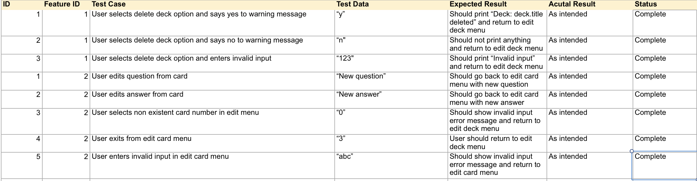

# Flashcard App

Flashcard App is a terminal app written in Ruby and is the first assessment of the Coder Academy Bootcamp Fast Track course. A link to the repository can be found here at [https://github.com/rmar8138/flashcard-app](https://github.com/rmar8138/flashcard-app).

## Statement of Purpose and Scope

Flashcard App is an application that builds decks of flashcards for users to use for study and review. Users create decks and fill them with cards, like any standard flashcard deck. These cards have a front and a back; the front holding the question and the back holding the answer. This will allow users to review any topic they wish straight from their command line!

## Features

- Create, Update, Edit and Delete Decks/Cards  
  Users are able to perform basic CRUD operations on decks and individual flashcards. User input is received and case statements and if/else statements are used to direct control flow. These decks are saved in a hash and stored locally in a JSON file.

- Review Decks  
  Users are able to review flashcards in a deck. Users can skip cards or answer whether they got the card right or wrong. Wrong cards sent to another array and recursion is used to repeatedly review until the user gets all cards correct. Users can also enter the --review flag when running the program followed by the name of a deck as an argument in order to have a quick review session without running the app completely.
- Change Settings

## User Interaction and Experience

Users are greeted with a welcome screen which allows them to select from a menu of options. These are:

1. Review
2. Add Deck
3. Edit Deck
4. Settings
5. Exit

##### Review

Users can select from their decks to review. Once a deck is selected, users enter a 'review'. In the review, the cards in the deck are shuffled and shown to the user one by one. The user can choose to show the answer, or skip the card, which will move the card to the end of the pile. Upon showing the answer, the user can select whether they were correct or incorrect. If correct, a running score is updated and the next card is showing. If incorrect, the card is removed from the current review and is placed to another deck for a subsequent review afterwards. These subsequent reviews are repeated until there are no incorrect cards left. A statistics screen is shown at the end of the whole review.

##### Add Deck

Users are able to create their own decks, and are prompted for a deck title. They can then create as many cards as they want.

##### Edit Deck

Users can view all of their decks and can either add extra cards, edit existing cards, delete cards, edit the deck title or delete the entire deck.

##### Settings

Users can change settings to alter the way reviews are structured. Under construction!

## Control Flow Diagram

Control Flow diagram of the app as of the latest commit can be found [here](./docs/flashcard-app-flowchart.pdf).

## Implementation Plan

Trello was used to keep track of feature and documentation backlog. When features where being implemented, feature cards would be placed in the 'In Progress' list. When they were finished, they would be moved to the 'Testing' list to be manually tested. Once manually tested, they moved to the 'Completed' list.


## Manual Testing

Manual testing was implemented as the app was being developed, and tested features were tracked on a separate spreadsheet. A screenshot of this can be seen below.



## Development Log

Development log can be viewed [here](./development-log.md).

## Help

Flashcard App relies on a few gems to run:

- TTY Prompt
- TTY Font
- TTY Table
- TTY Box

```
gem install tty-prompt
gem install tty-font
gem install tty-table
gem install tty-box
```
